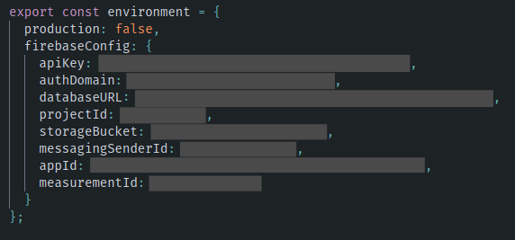

# Qualidata

## Configuring the environment

### Configuring the Firebase Project

First, if you don't have it already, create a Firebase project ([link here](https://firebase.google.com/)), go to Project Overview and click in "Add app", then choose a name for your web app. After that you will see a config file such as this one:


Here copy the parameters under

```javascript
var firebaseConfig = {...}
```

and paste them in the file at

```
src/environments/environment.ts
```



under firebaseConfig property.

### Configuring the database

Now, go to Cloud Firestore and create 7 collections:

- categories
- codes
- fragments
- networks
- projects
- sources
- users

## Running the application

### Prerequisites

- Node 12

### Starting
To start the application run:
```
npm install
npm start
```
The application is now running on localhost:4200
